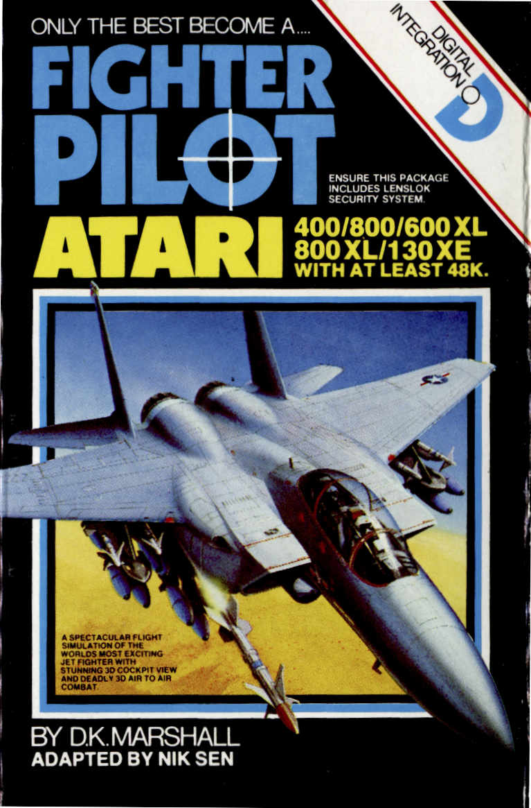
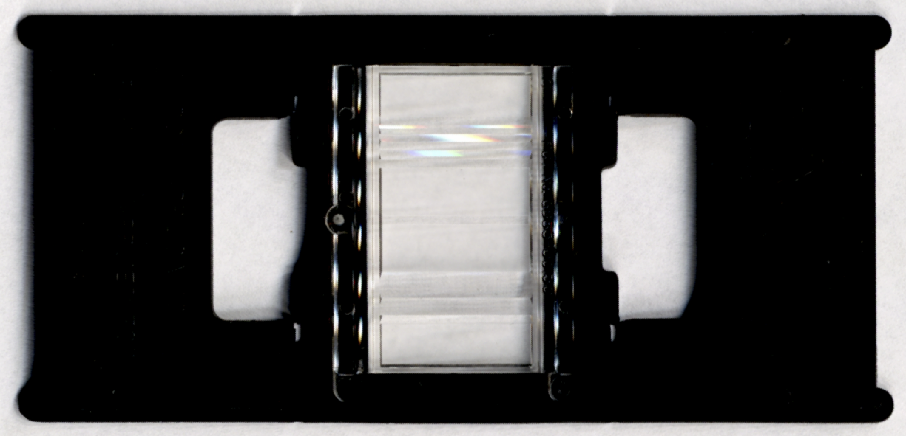
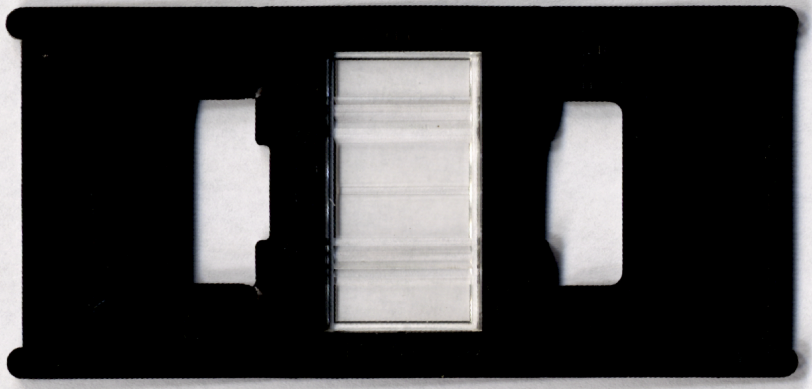

# Fighter Pilot

- 

Fighter Pilot for the Atari 400/800/600XL/800XL/130XE with at least 48K.

The game is tape based and protected with Lenslok. I started by converting the tape into a WAV file `Fighter Pilot.wav`. Then I used A8CAS to convert it into a CAS file `Fighter Pilot.cas`.

I wrote a little Python script `convertCAS2BIN.py` to extract the data out of the CAS file into 6 blocks `Fighter Pilot.cas_<BLOCK NUMBER>_<LOAD ADDRESS>.bin`. The loader is the first part loading at $A100…$A77F. Each chunk is the standard 128 bytes large. The loader then loads all the other blocks, which have a header mark of $FD instead of $FC and they have various chunk lengths.

After loading everything the Lenslok check is started at $8100. If it succeeds, the code between $0500…$7FFF is decrypted and the game is launched at $04EB.

Another Python script `createXEX.py` can be used to generate two XEX files: `Fighter Pilot LENSLOK.xex` with the original game and Lenslok and `Fighter Pilot.xex` without Lenslok and decrypted.

I analyzed the Lenslok code with IDA Pro. The `idb` files for the code with Lenslok protection `Fighter Pilot LENSLOK.idb` and the decrypted game without it `Fighter Pilot.idb`. `decrypt.idc` is an IDA Pro script, which decrypts the game code within the disassembler.

Additional files:

- [Manual Markdown](Manual.md)
- 
- 
- 
- 
- 
- 
- 
